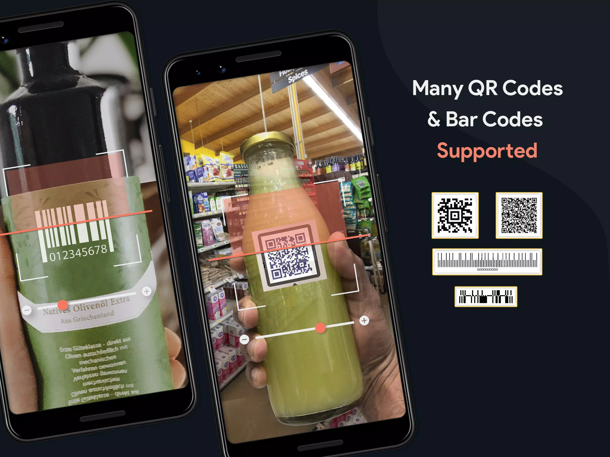
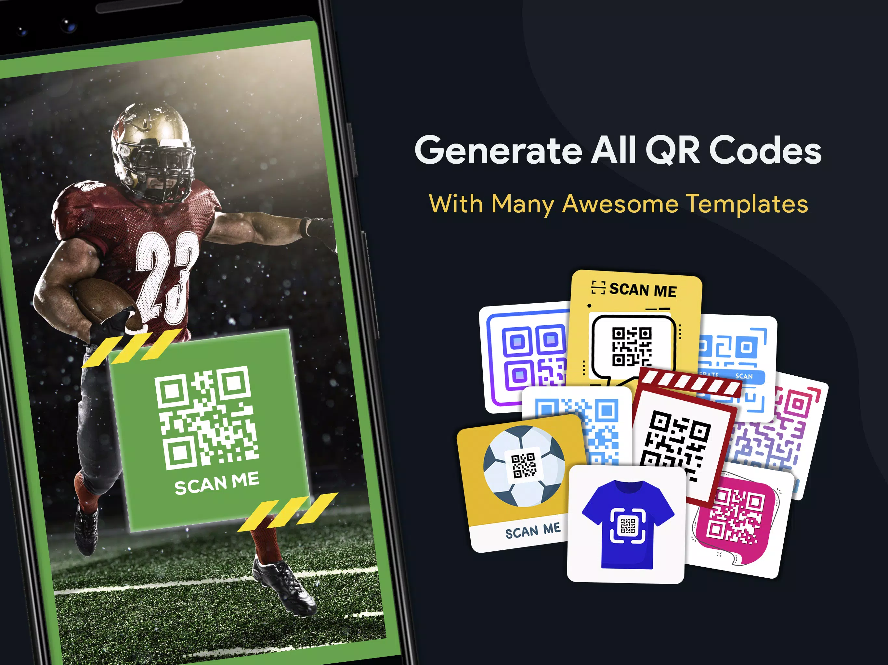
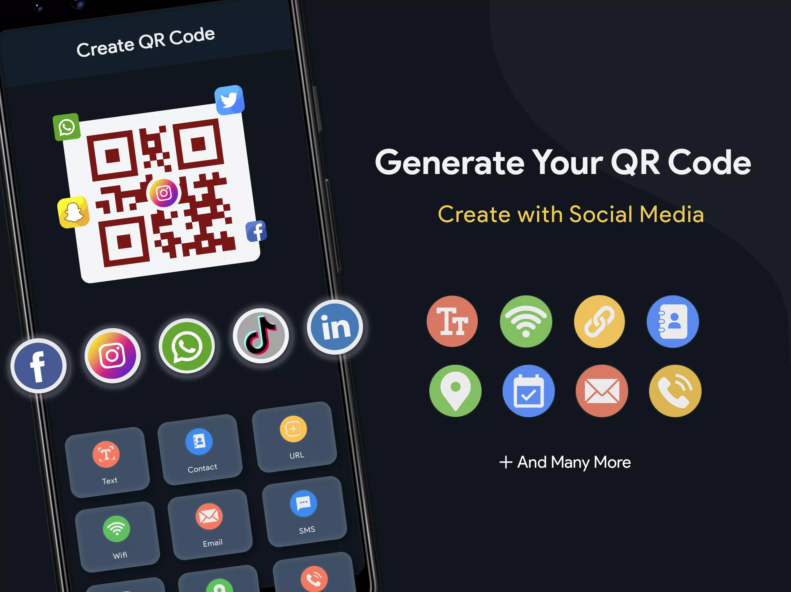
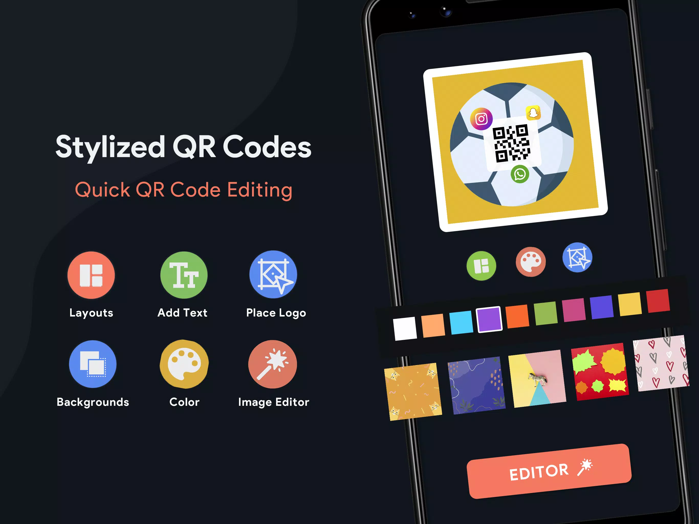
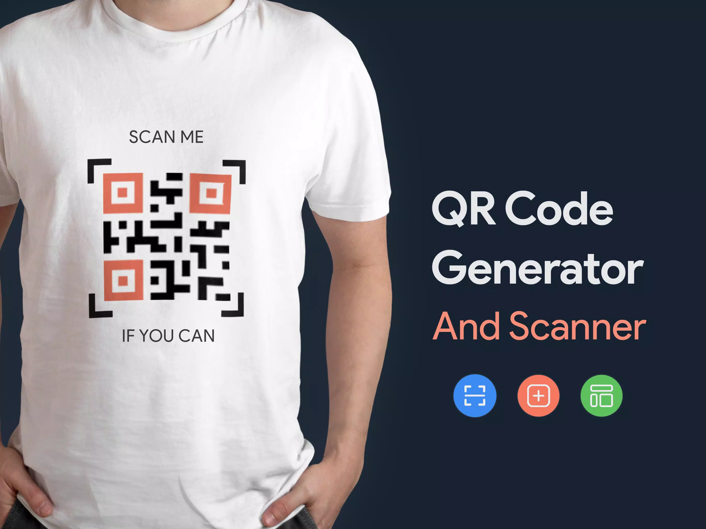

# Scanly — QR Code Scanner & Generator


-blue)
-blue)


A full-featured Android QR code and barcode utility app. Scan any supported format with the camera or from gallery images, generate styled QR codes with full customization, and manage a persistent history of scanned and created codes — all with multi-language support across 14 locales.

---

## Table of Contents

- [Features](#features)
- [Screenshots](#screenshots)
- [Tech Stack](#tech-stack)
- [Architecture & Project Structure](#architecture--project-structure)
- [Getting Started](#getting-started)
- [Supported Barcode Formats](#supported-barcode-formats)
- [Permissions](#permissions)
- [Localization](#localization)
- [Firebase Integration](#firebase-integration)
- [Contributing](#contributing)
- [License](#license)

---

## Features

### Scanning
- Real-time camera scanning using ZXing
- Front/rear camera switching
- Flash (torch) toggle
- Pinch-to-zoom and SeekBar zoom control
- Gallery image scanning (decode from existing photos)
- Vibration and audio feedback on successful scan

### QR Code Generation
- Support for **13+ barcode formats** (see [Supported Formats](#supported-barcode-formats))
- Input types: Text, URL, WiFi, Phone, Email, SMS, vCard, Location, Calendar Event, Social Media links
- **Custom QR styling**: pixel shapes, frame shapes, eye-dot shapes, gradients, logo overlay
- Error correction level selection (L / M / Q / H)
- Save generated code as **image** or **PDF**
- Share directly from the app

### Result Actions
After scanning, the app intelligently handles result types:
- **URL** — auto-open in browser (configurable)
- **Phone** — direct call intent
- **Email** — compose intent pre-filled
- **WiFi** — one-tap connect to network
- **Contact (vCard)** — save to device contacts
- **Location** — open in Google Maps
- **Calendar Event** — create in device calendar
- **SMS** — compose pre-filled SMS

### History
- Separate tabs for **Scanned** and **Created** history
- Timestamped entries with barcode type indicators
- Delete individual entries or clear all
- Tap any entry to reuse

### Settings
- Autofocus toggle
- Vibration feedback toggle
- Auto-open URLs toggle
- Full dark mode support

---

## Screenshots

| | |
|---|---|
|  |  |
| **Instant Scanner** — real-time camera scanning with flash, gallery & zoom controls | **Generate All QR Codes** — 13+ formats with pre-built template library |
|  |  |
| **Create QR Code** — generate from Text, URL, WiFi, Email, SMS, Contact, Social Media & more | **Stylized QR Codes** — customize layouts, colors, backgrounds, logos & apply the built-in image editor |
|  | |
| **QR Code Generator & Scanner** — all-in-one scan, create, and manage utility | |

---

## Tech Stack

| Category | Library / Tool | Version |
|---|---|---|
| Language | Kotlin + Java | Kotlin 1.9.0 / Java 17 |
| Build System | Gradle (AGP) | 8.4.0 |
| UI | AndroidX AppCompat, ConstraintLayout, Material Design | 1.7.0 / 2.1.4 / 1.12.0 |
| Navigation | AndroidX Navigation Component | 2.4.2 |
| QR Scanning | ZXing Android Embedded | 4.3.0 |
| QR Decoding Core | ZXing Core | 3.3.0 |
| QR Generation | custom-qr-generator (alexzhirkevich) | 1.4.1 |
| Image Loading | Glide | 4.13.0 |
| PDF Export | iText PDF | 5.5.10 |
| Permissions | Dexter | 6.2.1 |
| Firebase | Analytics, Crashlytics, Cloud Messaging | BOM 31.2.2 |
| Scalable Units | SDP Android | 1.0.6 |
| Maps & Location | Google Play Services Maps, Location | 17.0.0 |
| UI Components | Dots Indicator, Indicator SeekBar, Material Spinner | Various |

---

## Architecture & Project Structure

The app follows a **Fragment-based single-Activity** pattern with a bottom navigation host (`DashboardActivity`). Business logic is distributed across utility classes, and the ZXing scanning engine is encapsulated in a local wrapper module.

```
scanly-qr-code-scanner-generator/
├── app/
│   └── src/main/
│       ├── java/com/infinity/interactive/scanqr/generateqr/
│       │   ├── activity/           # 29 Activity files (Kotlin + Java)
│       │   │   ├── EntryActivity           # Splash / onboarding
│       │   │   ├── DashboardActivity       # Bottom nav host
│       │   │   ├── GenerateActivity        # Barcode generation
│       │   │   ├── CustomQRCode            # Advanced QR styling
│       │   │   ├── ResultActivity          # Post-scan result handling
│       │   │   └── SaveQRCode              # Save/export generated codes
│       │   ├── fragment/           # 4 bottom-nav Fragments (Kotlin)
│       │   │   ├── QRScanFragment          # Camera scanning UI
│       │   │   ├── QRGenerateFragment      # Code generation UI
│       │   │   ├── QRHistoryFragment       # Scan/create history
│       │   │   └── QRSettingsFragment      # App preferences
│       │   ├── adapter/            # 13 RecyclerView / ViewPager adapters
│       │   ├── AdEvents/           # Ad lifecycle controller
│       │   ├── data/
│       │   │   ├── constant/       # App-wide constants and static models
│       │   │   └── preference/     # SharedPreferences wrappers & data models
│       │   ├── pushnotification/   # Firebase FCM receiver
│       │   ├── utility/            # CodeGenerator, DialogUtils, AppUtils, etc.
│       │   └── zxing/              # ZXing camera integration wrapper
│       │       └── core/           # CameraPreview, CameraWrapper, ViewFinder
│       └── res/
│           ├── layout/             # 43 XML layout files
│           ├── drawable/           # 250+ PNG / WebP / vector assets
│           ├── navigation/         # Nav graph XML
│           ├── values[-XX]/        # 14 locale variants + night theme
│           └── xml/                # file_paths, data_extraction_rules
└── custom_qr_generator/            # Local library module (QR styling engine)
    └── src/main/java/com/github/alexzhirkevich/customqrgenerator/
        ├── style/                  # Shapes, colors, logos, gradients
        ├── encoder/                # QR matrix encoding & rendering
        └── dsl/                    # Kotlin DSL builder API
```

---

## Getting Started

### Prerequisites

- **Android Studio** Hedgehog (2023.1.1) or later
- **JDK 17**
- **Android SDK** with API 24–34 installed
- A `google-services.json` file from your Firebase project placed in `app/`

### Clone & Open

```bash
git clone https://github.com/your-username/scanly-qr-code-scanner-generator.git
cd scanly-qr-code-scanner-generator
```

Open the project root in Android Studio and let Gradle sync complete.

### Firebase Setup

1. Create a project in the [Firebase Console](https://console.firebase.google.com/).
2. Register your app with the application ID `com.infinity.interactive.scanqr.generateqr`.
3. Download `google-services.json` and place it in the `app/` directory.
4. Enable **Crashlytics**, **Analytics**, and **Cloud Messaging** in the Firebase console.

### Build & Run

```bash
# Debug build
./gradlew assembleDebug

# Release build (requires a keystore configured in build.gradle.kts)
./gradlew assembleRelease
```

Install on a connected device or emulator:

```bash
./gradlew installDebug
```

---

## Supported Barcode Formats

| Format | Scan | Generate |
|--------|:----:|:--------:|
| QR Code | ✅ | ✅ |
| Code 128 | ✅ | ✅ |
| Code 39 | ✅ | ✅ |
| Code 93 | ✅ | ✅ |
| EAN-13 | ✅ | ✅ |
| EAN-8 | ✅ | ✅ |
| UPC-A | ✅ | ✅ |
| UPC-E | ✅ | ✅ |
| Aztec | ✅ | ✅ |
| Data Matrix | ✅ | ✅ |
| PDF 417 | ✅ | ✅ |
| ITF | ✅ | ✅ |
| Codabar | ✅ | ✅ |
| MaxiCode | ✅ | — |
| Micro QR | — | ✅ |

---

## Permissions

| Permission | Purpose |
|---|---|
| `CAMERA` | Live camera scanning |
| `VIBRATE` | Haptic feedback on scan |
| `INTERNET` | Firebase services |
| `ACCESS_NETWORK_STATE` | Network-aware features |
| `ACCESS_WIFI_STATE` / `CHANGE_WIFI_STATE` | WiFi QR code connect |
| `ACCESS_FINE_LOCATION` / `ACCESS_COARSE_LOCATION` | Location-based QR generation |
| `CALL_PHONE` | Direct call from scanned phone numbers |
| `READ_CONTACTS` | Contact lookups |
| `READ_EXTERNAL_STORAGE` / `READ_MEDIA_IMAGES` | Gallery image scanning |
| `WRITE_EXTERNAL_STORAGE` | Save generated QR codes (API ≤ 28) |
| `RECEIVE_BOOT_COMPLETED` | Notification scheduling on reboot |
| `GET_ACCOUNTS` | Account-linked features |

> Runtime permissions are managed via **Dexter** with user-friendly rationale dialogs.

---

## Localization

The app ships with string resources for **14 language variants**:

| Code | Language |
|------|----------|
| default | English |
| `ar` | Arabic |
| `an` | Aragonese |
| `de` | German |
| `es-rES` | Spanish (Spain) |
| `fr` | French |
| `hi` | Hindi |
| `it` | Italian |
| `iw` | Hebrew |
| `pt` | Portuguese |
| `ru` | Russian |
| `tr` | Turkish |
| `zh` | Chinese |
| `values-night` | Dark Mode overrides |

---

## Firebase Integration

| Service | Usage |
|---|---|
| **Firebase Analytics** | Screen views, user engagement events |
| **Firebase Crashlytics** | Automatic crash reporting and stack traces |
| **Firebase Cloud Messaging (FCM)** | Push notification delivery via `FireBaseNotification` receiver |

---

## Contributing

Contributions, issues, and feature requests are welcome.

1. Fork the repository
2. Create your feature branch: `git checkout -b feature/your-feature`
3. Commit your changes: `git commit -m 'feat: add your feature'`
4. Push to the branch: `git push origin feature/your-feature`
5. Open a Pull Request

Please follow [Conventional Commits](https://www.conventionalcommits.org/) for commit messages.

---

## License

```
MIT License

Copyright (c) 2024 Infinity Interactive

Permission is hereby granted, free of charge, to any person obtaining a copy
of this software and associated documentation files (the "Software"), to deal
in the Software without restriction, including without limitation the rights
to use, copy, modify, merge, publish, distribute, sublicense, and/or sell
copies of the Software, and to permit persons to whom the Software is
furnished to do so, subject to the following conditions:

The above copyright notice and this permission notice shall be included in all
copies or substantial portions of the Software.

THE SOFTWARE IS PROVIDED "AS IS", WITHOUT WARRANTY OF ANY KIND, EXPRESS OR
IMPLIED, INCLUDING BUT NOT LIMITED TO THE WARRANTIES OF MERCHANTABILITY,
FITNESS FOR A PARTICULAR PURPOSE AND NONINFRINGEMENT. IN NO EVENT SHALL THE
AUTHORS OR COPYRIGHT HOLDERS BE LIABLE FOR ANY CLAIM, DAMAGES OR OTHER
LIABILITY, WHETHER IN AN ACTION OF CONTRACT, TORT OR OTHERWISE, ARISING FROM,
OUT OF OR IN CONNECTION WITH THE SOFTWARE OR THE USE OR OTHER DEALINGS IN THE
SOFTWARE.
```
